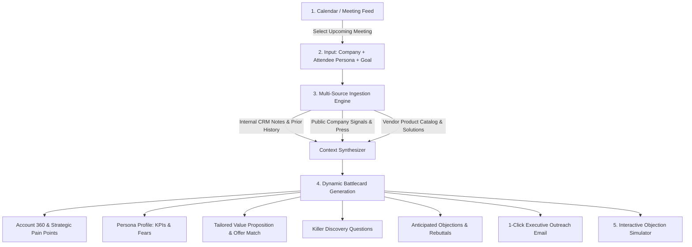

# 02. Solution Concept & Feature Specification

## 1. Product Concept: DealPilot AI
**DealPilot AI** is an autonomous pre-meeting intelligence and pitch strategy platform for enterprise B2B sales teams. It transforms raw, fragmented account context into an actionable, executive-ready **Meeting Battlecard** in under 30 seconds.

---

## 2. Target Personas
* **Primary User: Enterprise Account Executive (AE):** Prepares for 4–6 client meetings a week; needs quick, deep context, pain point analysis, and customized talking points.
* **Secondary User: Sales Engineer / Solutions Architect:** Needs technical context on the prospect's current infrastructure and solution compatibility.
* **Tertiary User: Head of Sales / Sales Enablement:** Wants consistent pitch quality, brand alignment, and rapid onboarding across distributed reps.

---

## 3. End-to-End User Journey (The 7-Minute Demo Flow)

---

## 4. Feature Matrix (MVP vs. Post-Hackathon Roadmap)

### **Phase 1: Hackathon MVP (Delivered by 5:30 PM)**
1. **Meeting Command Center:**
   - Visual dashboard of upcoming scheduled prospect calls.
   - Pre-loaded enterprise scenarios (e.g., Global Retailer, FinTech Bank, Healthcare Network).
   - "Custom Account" mode allowing judges to type in any real or synthetic company name and role.
2. **Autonomous Account Dossier Engine:**
   - Synthesizes industry trends, financial indicators, and recent initiatives.
   - Identifies acute business triggers (e.g., regulatory compliance deadlines, cloud migrations, margin pressure).
3. **Persona & Stakeholder Profiler:**
   - Identifies attendee role (e.g., Chief Technology Officer, VP of Supply Chain, Head of Procurement).
   - Maps out personal KPIs, career risks, and decision-making drivers.
4. **Value Proposition & Solution Matcher:**
   - Automatically maps the vendor's enterprise product modules to the customer's specific problems (no generic pitch).
5. **Interactive Meeting Cheat Sheet (Battlecard):**
   - **Top 3 High-Impact Discovery Questions** (probing questions that provoke executive thought).
   - **Anticipated Objections & Tactical Counter-arguments**.
   - **2-Minute Executive Elevator Pitch**.
   - **Post-Meeting Follow-up / Pre-Meeting Primer Email Generator**.
6. **Live Roleplay / Objection Handling Simulator:**
   - Sales rep can test a tough objection (e.g. *"Our budget is frozen until Q3"*) and the AI provides instant, contextual rebuttal coaching.

---

### **Phase 2: Future Roadmap (What to build next with more time)**
* Live Zoom/Teams Real-Time Audio Copilot listening during the call and popping unobtrusive cue cards.
* Deep two-way CRM integration (Salesforce/HubSpot) to auto-log call notes and update deal stages.
* Cross-BU Collision Detection (alerting when another regional team touches the same parent company).
* Automated ROI Calculator tailored to prospect's public revenue/headcount.
