# 05. Master AWS Native Enterprise Architecture

## 1. Executive Summary
While the Hackathon MVP is rapidly deployed via **Next.js (Vercel)** and **Express.js (Render)** to meet the 5:30 PM deadline, the **Production Master Architecture** is designed to be **100% AWS Native**. 

This satisfies enterprise requirements for:
* **SOC2 / HIPAA / GDPR Security & Multi-tenancy**
* **Low-latency Real-time Generative Inference**
* **High-throughput Semantic Search across millions of enterprise CRM documents**
* **Automated CI/CD GitOps with GitHub Actions into AWS ECR & ECS**

---

## 2. High-Level AWS Architecture Diagram

```
                                      [Users / Enterprise Reps]
                                                  │
                                                  ▼
                                      ┌───────────────────────┐
                                      │   Amazon Route 53     │ (DNS & Failover)
                                      └───────────┬───────────┘
                                                  ▼
                                      ┌───────────────────────┐
                                      │   AWS WAF & Shield    │ (DDoS & Threat Protection)
                                      └───────────┬───────────┘
                                                  ▼
                                      ┌───────────────────────┐
                                      │   Amazon CloudFront   │ (Global Edge CDN)
                                      └─────┬───────────┬─────┘
                     Static Assets (S3)     │           │ Dynamic API / Next.js SSR
             ┌──────────────────────────────┘           └────────────────────────────────┐
             ▼                                                                           ▼
┌─────────────────────────┐                                                 ┌─────────────────────────┐
│     Amazon S3 Bucket    │                                                 │ Application Load        │
│   (Next.js Web Build)   │                                                 │ Balancer (ALB)          │
└─────────────────────────┘                                                 └───────────┬─────────────┘
                                                                                        │
                                                                                        ▼
                                                                            ┌─────────────────────────┐
                                                                            │ Amazon ECS (Fargate)    │
                                                                            │ Microservices Cluster   │
                                                                            │ ┌─────────────────────┐ │
                                                                            │ │  Next.js Web Pods   │ │
                                                                            │ ├─────────────────────┤ │
                                                                            │ │  Express.js API Pods│ │
                                                                            │ └─────────────────────┘ │
                                                                            └───────────┬─────────────┘
                                                                                        │
               ┌─────────────────────────────────┬──────────────────────────────────────┼──────────────────────────────┐
               ▼                                 ▼                                      ▼                              ▼
┌─────────────────────────┐       ┌─────────────────────────┐           ┌─────────────────────────┐     ┌────────────────────────┐
│     Amazon Bedrock      │       │ Amazon OpenSearch       │           │ Amazon Aurora Serverless│     │   Amazon ElastiCache   │
│  - Claude 3.5 Sonnet    │       │ Serverless              │           │ PostgreSQL (pgvector)   │     │        (Redis)         │
│  - Amazon Titan Embed   │       │  - Vector Database      │           │  - Multi-tenant CRM DB  │     │  - Session state       │
│  - Guardrails & Agents  │       │  - Product Knowledge    │           │  - Battlecard storage   │     │  - Real-time token     │
└─────────────────────────┘       └─────────────────────────┘           └─────────────────────────┘     │    streaming cache     │
                                                                                                        └────────────────────────┘
```

---

## 3. Subsystem Breakdown

### A. Edge & Ingress Security
* **Amazon Route 53:** Low-latency DNS routing, health checks, and failover across multi-availability zones.
* **AWS WAF (Web Application Firewall):** Bot prevention, rate limiting, IP whitelisting for enterprise clients.
* **Amazon CloudFront:** Secure SSL termination, global edge caching for Next.js static chunks, and TLS 1.3 encryption.

### B. Compute & Microservices (Serverless Container Orchestration)
* **Amazon ECS on AWS Fargate:**
  * Runs serverless Docker containers for both **Next.js frontend** and **Express.js API gateway**.
  * Eliminates server patching, autoscales based on CPU/Memory and queue depth (0 to 100+ tasks).
* **AWS Application Load Balancer (ALB):**
  * Path-based routing: `/api/*` routed to Express.js microservice; `/*` routed to Next.js SSR.
  * Native support for HTTP/2 and WebSockets for real-time live LLM streaming.

### C. Generative AI & Vector Search Layer
* **Amazon Bedrock:**
  * Primary Foundation Models: **Anthropic Claude 3.5 Sonnet** (for deep enterprise reasoning, objection handling, and pitch drafting) and **Titan Embeddings G1** (for semantic vectorization).
  * **Amazon Bedrock Guardrails:** Enforces PII redaction, brand tone guidelines, and prevents hallucinations.
  * **Bedrock Knowledge Bases:** Managed RAG pipeline connecting internal vendor whitepapers and product collateral.
* **Amazon OpenSearch Serverless (Vector Engine):**
  * Stores embeddings of customer 10-K filings, press releases, past email threads, and product catalog items.
  * Enables hybrid search (BM25 keyword search + vector cosine similarity).

### D. Data Persistence & Multi-Tenancy
* **Amazon Aurora PostgreSQL Serverless v2:**
  * Multi-tenant relational store for users, accounts, meeting schedules, deal stages, and generated battlecards.
  * Automatic scaling down during off-peak hours and scaling up during heavy morning sales prep spikes.
* **Amazon ElastiCache for Redis:**
  * Sub-millisecond caching of synthesized account profiles and token-stream session states.
* **Amazon S3 (Encrypted Storage):**
  * Stores unstructured meeting transcripts, customer presentations, audio notes, and exported PDF battlecards.
  * Managed by S3 Lifecycle policies (transition to Glacier for compliance archiving).

### E. Enterprise Security & Governance
* **AWS KMS (Key Management Service):** Customer-managed encryption keys for data-at-rest across S3, Aurora, and OpenSearch.
* **AWS Secrets Manager:** Secure storage and automated rotation of API keys and database credentials.
* **AWS IAM with Least Privilege:** Role-based access control (RBAC) connecting ECS tasks to Bedrock and Aurora without hardcoded credentials.

---

## 4. GitOps CI/CD Pipeline (GitHub to AWS Native)

```mermaid
graph LR
    Dev[Developer / Git Push] -->|Push to main| GH[GitHub Actions CI]
    GH -->|1. Run Unit Tests & Linting| Test[Automated Tests]
    Test -->|2. Build Docker Containers| Build[Docker Build Client & Server]
    Build -->|3. Push Images| ECR[Amazon ECR Container Registry]
    ECR -->|4. Trigger Deployment| CD[AWS CodePipeline / ECS Deployment]
    CD -->|5. Rolling Zero-Downtime Update| ECS[Amazon ECS Fargate Cluster]
```



### Pipeline Steps:
1. **Developer Push:** Pull Request merged into `main` branch on GitHub.
2. **GitHub Actions Workflow:**
   * Runs TypeScript validation, ESLint, and API endpoint integration tests.
   * Builds optimized production Docker images for both `client` (Next.js) and `server` (Express.js).
3. **Amazon ECR (Elastic Container Registry):** Scans container images for vulnerabilities with Amazon Inspector and tags with commit SHA.
4. **ECS Zero-Downtime Rolling Update:** AWS ECS updates tasks with green/blue deployment, ensuring uninterrupted sales rep access.

---

## 5. Transition Path: From MVP to AWS Native

| Component | Hackathon MVP (Today 5:30 PM) | AWS Native Master Architecture |
| :--- | :--- | :--- |
| **Frontend Hosting** | Vercel (Next.js) | CloudFront + S3 + ECS Fargate SSR |
| **Backend Hosting** | Render (Express.js) | AWS ECS Fargate + ALB |
| **GenAI Inference** | Direct Gemini / Claude API | Amazon Bedrock + Bedrock Guardrails |
| **Search / Context** | In-memory synthetic knowledge store | Amazon OpenSearch Serverless (Hybrid Vector) |
| **Database** | In-memory / JSON Store | Amazon Aurora Serverless v2 (PostgreSQL) |
| **CI/CD** | GitHub to Render/Vercel Auto-deploy | GitHub Actions -> Amazon ECR -> AWS ECS Fargate |

> **Slide Tip for Demo:** Highlighting this transition table to judges shows deep technical maturity: you built a working prototype today in hours, but engineered the architectural blueprint ready for Day-2 enterprise scale.
